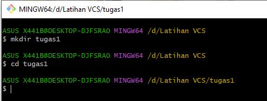
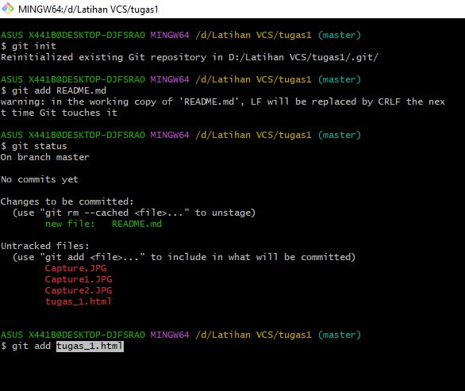

# CARA MENGGUNAKAN GIT
1.Download Git, buka website resminya Git (git-scm.com).

2.Kemudian unduh Git sesuai dengan arsitektur komputer kita. Kalau menggunakan 64bit, unduh yang 64bit. Begitu juga kalau menggunakan 32bit.

3.setelah terinstall,Untuk mencobanya, silahkan buka CMD atau PowerShell, kemudian ketik perintah

git --version.

# Menambahkan Global Config

1.Pada saat pertama kali menggunakan git, perlu dilakukan konfigurasi user.name dan user.email

2.konfigurasi ini bisa dilakukan untuk global repostiry atau individual repository.

apabila belum dilakukan konfigurasi, akan mengakibatkan terjadi kegagalan saat menjalankan perintah git commit
    
Config Global Repository
$ git config --global user.name “nama_user”

$ git config --global user.email “nama_user”

# Membuat Reposiory Local

• Buka direktory aktif, misal: /d/Latihan VCS (buka menggunakan Windows Explorer)

• Buat direktory project praktikum pertama dengan nama <strong>Tugas1

• Sehingga terbentuk satu direktori baru dibawahnya, selanjutnya masuk kedalam direktori tersebut dengan perintah <strong>cd</strong>
(change directory)

• direktory aktif menjadi: /d/Latihan VCS/Tugas1

# Membuat Repository Local

• Jalankan perintah git init, untuk membuat repository local.

• lalu tambahkan git add README.md

• Repository baru berhasil di inisialisasi, dengan terbentuknya satu direktori hidden dengan nama .git

• Pada direktori tersebut, semua perubahan pada working directory akan disimpan.

# Menambahkan File baru pada repository

• Untuk membuat file dapat menggunakan text editor, lalu menyimpan filenya pada direktori aktif (repository)

• ketik perintah git commit -m "file pertama"

• git remote add origin https://github.com/Muhamadali010/Latihan1.git

• git push -u origin master/main

