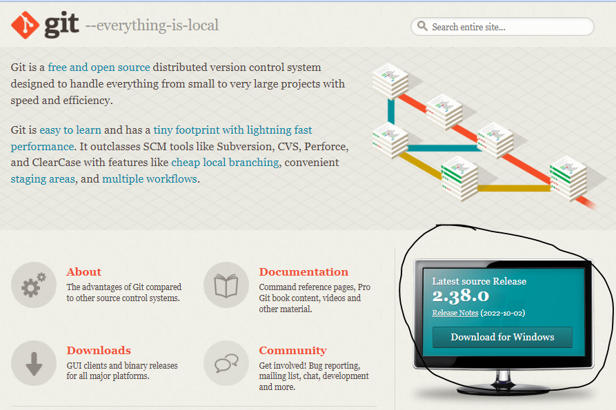
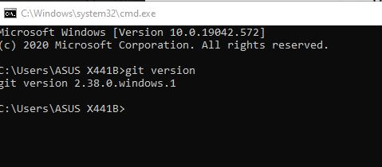
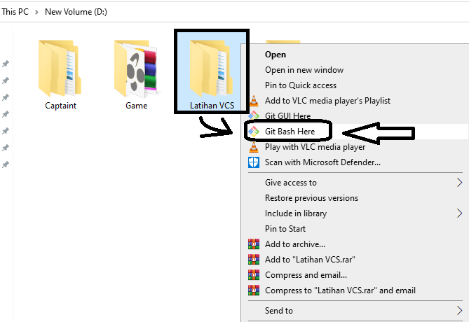
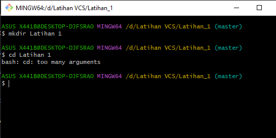
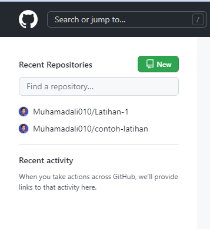
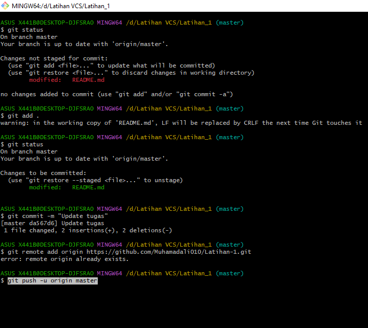
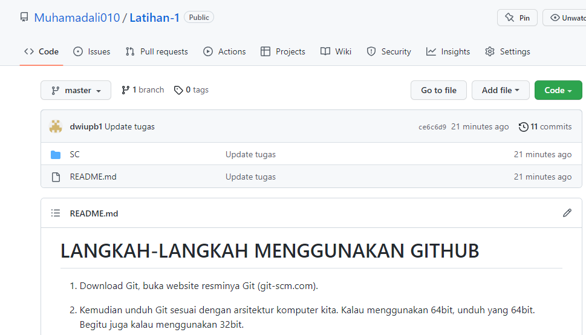

# LANGKAH-LANGKAH MENGGUNAKAN GITHUB
1. Download Git, buka website resminya Git (git-scm.com).

2. Kemudian unduh Git sesuai dengan arsitektur komputer kita. Kalau menggunakan 64bit, unduh yang 64bit. Begitu juga kalau menggunakan 32bit.

3. setelah terinstall,Untuk mencobanya, silahkan buka CMD atau PowerShell, kemudian ketik perintah

  git --version.

# Menambahkan Global Config

1. Pada saat pertama kali menggunakan git, perlu dilakukan konfigurasi user.name dan user.email

2. konfigurasi ini bisa dilakukan untuk global repository atau individual repository.

  apabila belum dilakukan konfigurasi, akan mengakibatkan terjadi kegagalan saat menjalankan perintah git commit
    

  Config Global Repository

$ git config --global user.name “nama_user”

$ git config --global user.email “nama_user”

# Membuat Reposiory Local

• Buka direktory aktif, misal: /d/Latihan VCS

• klik kanan pada direktory aktif tersebut, dan pilih menu Git Bash here

• Buat direktory project praktikum pertama dengan nama <strong>Latihan_1

• Sehingga terbentuk satu direktori baru dibawahnya, selanjutnya masuk kedalam direktori tersebut dengan perintah <strong>cd</strong>
  (change directory)

• direktory aktif menjadi: /d/Latihan VCS/Latihan_1

# Membuat Repository github

• Login Akun github

• klik New Recen Repositories

• Pada direktori tersebut, semua perubahan pada working directory akan disimpan.

# Menambahkan File baru pada repository

• Jalankan git status, lalu jalan perintah git add .

• Jalankan perintah git commit -m "Update Tugas"

• git remote add origin https://github.com/Muhamadali010/Latihan1.git

• git push -u origin master/main

• Maka Hasilnya akan seperti ini

JANGAN LUPA LINK NYA DI UPLOAD DI E-CAMPUS YA.......!!!!!!

#.....................THANK YOU.......................
